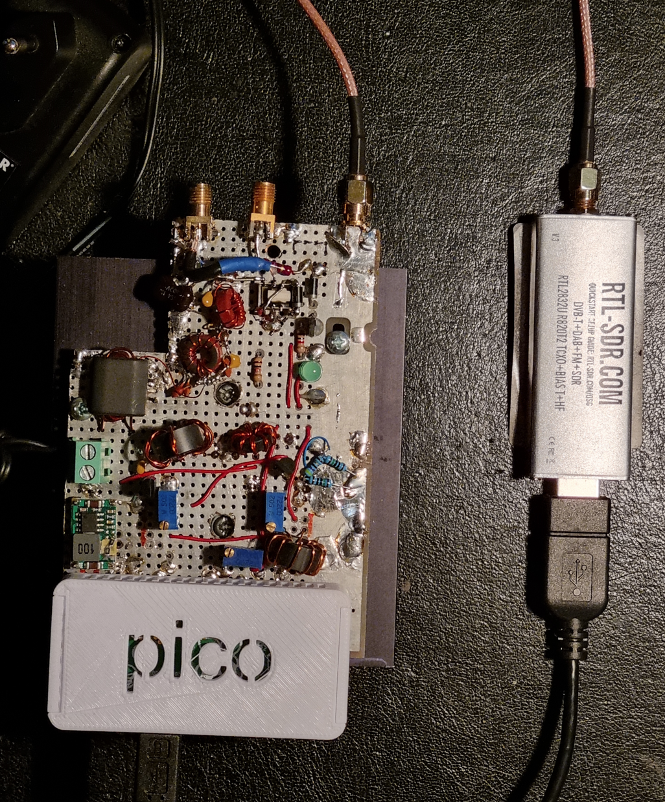

# rtlsdr-ft8d -- Single-Band HF FT8 transceiver based on RTL receiver




## TL;DR

This project aim at decoding [FT8](https://en.wikipedia.org/wiki/WSJT_(amateur_radio_software)#FT8) signals using an [RTL device](https://osmocom.org/projects/rtl-sdr/wiki/Rtl-sdr), usually connected to a [Raspberry Pi](https://www.raspberrypi.org/) and exploiting the RPi for generating the FT8 signal.
Note that it requires proper License and HW for fulfilling the relevant rules.
To install and use your dongle on a Raspberry Pi with a Raspberry Pi OS, follow these steps but
first be sure that the proper firmware is up to date, if not run
# sudo rp-update

```bash
echo "== Install dependencies"
sudo apt-get update && sudo apt-get -y install build-essential clang cmake libfftw3-dev libusb-1.0-0-dev libcurl4-gnutls-dev git tmux

echo "== Install rtl-sdr library (on RPi, don't use your distro package)"
git clone https://github.com/rtlsdrblog/rtl-sdr-blog
cd rtl-sdr-blog/
mkdir build
cd build
cmake -DCMAKE_INSTALL_PREFIX:PATH=/usr -DDETACH_KERNEL_DRIVER=ON -Wno-dev ../ -DINSTALL_UDEV_RULES=ON
make
sudo make install
sudo cp ../rtl-sdr.rules /etc/udev/rules.d/
sudo ldconfig
echo 'blacklist dvb_usb_rtl28xxu' | sudo tee --append /etc/modprobe.d/blacklist-dvb_usb_rtl28xxu.conf
cd ../..

# ntp seems not needed but we have to fix ntp stuffs anyhow, this applies to Raspberry Pi OS
cd rtl-sdr-blog/
sudo apt install systemd systemd-timesyncd
sudo systemctl stop systemd-timesyncd
sudo cp timesyncd.conf /etc/systemd/timesyncd.conf 
sudo systemctl start systemd-timesyncd
cd ..

#git clone https://github.com/steve-m/librtlsdr
#cd librtlsdr
#mkdir -p make
#cd make
#cmake -DCMAKE_INSTALL_PREFIX:PATH=/usr -DDETACH_KERNEL_DRIVER=ON -Wno-dev ..
#make
#sudo make install
#cd ../..

echo "== Install rtlsdr-ft8d"
git clone https://github.com/Claudio-Sjo/rtlsdr-ft8d
cd rtlsdr-ft8d
git clone https://github.com/kgoba/ft8_lib
git submodule update --init --recursive
make
sudo make install

# create the directory for logging QSO as ADI files
if [ -d ~/ft8QSOdir ]; then
  echo "~/ft8QSOdir does exist."
  else
  mkdir ~/ft8QSOdir
fi

echo "== Start/test rtlsdr-ft8d"
rtlsdr_ft8d -f 2m -c A1XYZ -l AB12cd -g 29
```

## Overview

This is an interactive RTx application allows automatic reporting of FT8 messages on Internet with [PSKreporter](https://pskreporter.info/pskmap.html). The initial idea was to allow a small computer like a Raspberry Pi and a RTL-SDR device to send FT8 reports for [VHF/UHF](https://en.wikipedia.org/wiki/Amateur_radio_frequency_allocations#Very_high_frequencies_and_ultra_high_frequencies) bands. This kind of lightweight setup could run continuously without maintenance and help to get additional propagation reports. This code is just a glue between RTL libs and an FT8 open source library based on [Karlis Goba (YL3JG) work](https://github.com/kgoba/ft8_lib).

The Transmitter is based on Si5351 chip for signal generation and related Power Amplification and filtering, the circuit diagram
is to be added. Interface between RPi and Si5351 goes via I2C by means of WirePi library.

This application written in C does:

- A time alignment (15 sec, required NTPd to run on the OS)
- Start the reception using the RTL lib
- Decimate the IQ data (2.4Msps to 3200 sps)
- Decode FT8 signals
- Report any CQ spots on PSKreporter (thanks to kholia https://github.com/kholia/rtlsdr-ft8d with small adjustment)
- Repeat, again and again...
- ft8 > /dev/null 2>1

## Documentation

The service creation is described here: https://linuxhandbook.com/create-systemd-services/


## Installation

  1. Install a Linux compatible distro on your device.

     For Raspberry Pi, you can download official images [here](https://www.raspberrypi.com/software/operating-systems/).

  2. It's a good practice to update your OS. With Pi OS, run this command as usual:
     ```bash
     sudo apt-get update && sudo apt-get upgrade
     ```

  3. Install dependencies & useful tools (for example, [NTP](https://en.wikipedia.org/wiki/Network_Time_Protocol) for time synchronization). Example with a Debian based OS, like Rasbian, or Raspberry Pi OS:
     ```bash
     sudo apt-get update && sudo apt-get -y install build-essential clang cmake libfftw3-dev libusb-1.0-0-dev libcurl4-gnutls-dev help2man ntp git
     ```

  4. Install `rtl-sdr` library manually. **Do not use the `librtlsdr-dev` package on Raspberry PiOS**. There is a know bug with this lib and rtlsdr_wsprd will not be able to get enough samples (don't decode anything & 100% CPU pattern).
     ```bash
     git clone https://github.com/steve-m/librtlsdr
     cd librtlsdr
     mkdir -p make
     cd make
     cmake -DCMAKE_INSTALL_PREFIX:PATH=/usr -DDETACH_KERNEL_DRIVER=ON -Wno-dev ..
     make
     sudo make install
     cd ../..
     ```
  Note: You may have to re-plug you dongle if it was already connected, or play with `udev` if not automatically detected.

  5. Clone this repository:
     ```bash
     git clone https://github.com/Claudio-Sjo/rtlsdr-ft8d
     cd rtlsdr-ft8d
     git clone https://github.com/kgoba/ft8_lib
     ```

  6. Build the application:
     ```bash
     make
     sudo make install
     ```

  7. Finally, start the application with the right parameters/options for you (frequency, callsign, locator etc... Fake example below):
     ```bash
     rtlsdr_ft8d -f 2m -c A1XYZ -l AB12cd -g 29
     ```

## Container Image

As an alternative to the above steps, a pre-built container image containing rtlsdr-ft8d is available for use with [Docker](https://www.docker.com/) or [Podman](https://podman.io/).

The RTL DVB kernel modules must first be blacklisted on the host running the container. RTL-SDR itself is not required on the host running the container. This can be permanently accomplished using the following commands:

```bash
echo 'blacklist dvb_usb_rtl28xxu' | sudo tee /etc/modprobe.d/blacklist-dvb_usb_rtl28xxu.conf
sudo modprobe -r dvb_usb_rtl28xxu
```

If the `modprobe -r` command errors, a reboot is recommended to unload the module.

You can then start the container with the right parameters/options for you (frequency, callsign, locator etc... Fake example below):

```bash
docker run --rm -it --pull=always --device=/dev/bus/usb ghcr.io/Claudio-Sjo/rtlsdr-ft8d:latest -f 2m -c A1XYZ -l AB12cd -g 29
```


## Tips (for your Raspberry Pi and SDR dongles)

  - Use ferrite bead on the USB cable to limit the QRN
  - Use an external clean power supply
  - Cut off the display (could help to reduce QRN)
    ```bash
    /opt/vc/bin/tvservice -o
    ```
  - Remove unused modules (for example, /etc/modules: #snd-bcm2835)
  - Use an enclosure, and ground it

## Crystal stability

Most of RTL dongles use a cheap crystal, and frequency drift can effect the decoding & performance. The use of no-name RTL dongle for VHF/UHF bands usually require crystal modification, for a better one. External clock could be also used, like GPSDO or rubidium reference clock, aligned on 28.8MHz.

Some manufacturers integrate a 0.5ppm TCXO. It's the best second option, after an external clock. Based on my personal experience:

- NooElec NESDR SMART : Works fine out of the box
- RTL-SDR Blog 1PPM TCXO : Works with some drift, require additional mass, or a better enclosure
- Other no-name like : RT820, E4000, FC0012, FC0013, can work, but require modification and usually drift a lot

## Performance & hardware tests

Some performance tests using:
- Raspbian GNU/Linux 11 (bullseye) for Raspberry Pi devices
- rtlsdr-ft8d version 0.3.4
- Build with `clang -O3 -std=gnu17`

| Hardware      | Supported          | RX Load | Decode burst |
| ------------- | ------------------ | ------- | ------------ |
| RPi-1         | :heavy_check_mark: | 24.4%   | 650ms        |
| RPi-2         | :heavy_check_mark: | 13.9%   | 290ms        |
| RPi-3         | :heavy_check_mark: |  9.4%   | 210ms        |
| RPi-4         | :heavy_check_mark: |  6.3%   | 120ms        |
| PC (i7-5820K) | :heavy_check_mark: |  1.8%   |  18ms        |
